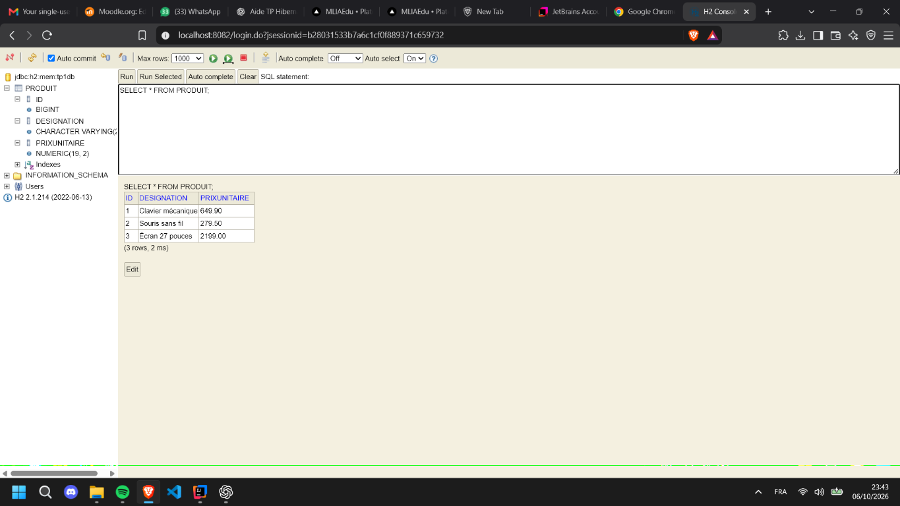
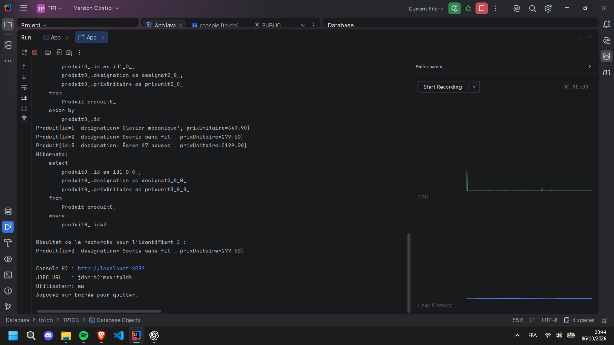

# TP1 — Catalogue de produits avec Hibernate et H2

Ce TP met en œuvre une application Java simple basée sur JPA/Hibernate avec une base de données H2 en mémoire. L'objectif est de gérer un catalogue de produits, d'enregistrer des données, de les lister et de rechercher un produit par son identifiant.

## Objectif du TP

- définir une entité JPA `Produit` ;
- configurer une unité de persistance Hibernate ;
- enregistrer plusieurs produits dans la base H2 ;
- récupérer l'ensemble des produits du catalogue ;
- rechercher un produit spécifique par son `id` ;
- visualiser la base via la console web H2.

## Stack technique

- Java 8
- Maven
- JPA / Hibernate 5.6.5
- Base de données H2 2.1.214
- SLF4J pour les logs

## Structure du projet

```text
TP1/
├── src/
│   ├── main/
│   │   ├── java/
│   │   │   └── org/example/
│   │   │       ├── App.java
│   │   │       ├── model/
│   │   │       │   └── Produit.java
│   │   │       └── repository/
│   │   │           └── CatalogueRepository.java
│   │   └── resources/
│   │       └── META-INF/
│   │           └── persistence.xml
│   └── test/
│       └── java/
│           └── org/example/AppTest.java
├── docs/
│   └── images/
│       ├── h2-produits.png
│       └── intellij-execution.png
├── pom.xml
├── README.md
└── .idea/
```

## Modèle de données

L'entité `Produit` contient :

- `id` : identifiant unique généré automatiquement ;
- `designation` : nom du produit ;
- `prixUnitaire` : prix associé au produit.

La classe `CatalogueRepository` encapsule les opérations de persistance :

- `enregistrer(List<Produit>)`
- `lister()`
- `trouver(Long identifiant)`

## Configuration de la base

La base H2 est initialisée en mémoire avec les paramètres suivants :

- URL JDBC : `jdbc:h2:mem:tp1db`
- Utilisateur : `sa`
- Mot de passe : vide
- Console web : `http://localhost:8082`

## Exécution de l'application

1. Ouvrir le projet dans IntelliJ IDEA ou un autre IDE Java.
2. Vérifier que Maven a bien téléchargé les dépendances.
3. Lancer la classe `org.example.App`.
4. La console affichera le catalogue des produits et le résultat de recherche du produit `id = 2`.
5. Ouvrir la console H2 dans le navigateur à l'adresse : `http://localhost:8082`

## Exemple de données insérées

Le programme crée automatiquement trois produits :

- Clavier mécanique — 649,90
- Souris sans fil — 279,50
- Écran 27 pouces — 2199,00

## Captures d'écran

### Console H2 : table `PRODUIT`

La requête `SELECT * FROM PRODUIT;` retourne les trois produits enregistrés dans la base.



### Exécution dans IntelliJ IDEA

L'application affiche la liste des produits ainsi que le produit retrouvé avec l'identifiant 2.



## Résultat attendu

À l'exécution, le programme affiche :

- les produits enregistrés ;
- le résultat de la recherche pour l'identifiant 2 ;
- les informations de connexion à la base H2.

Ce TP permet de comprendre les bases du mapping JPA/ORM et l'utilisation d'une base de données légère en mémoire pour un projet Java.
